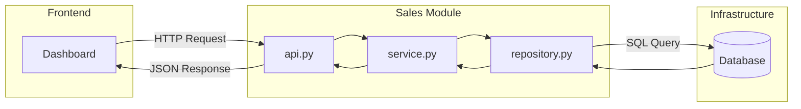

# Coffee - KPI - Dashboard

## Objetivo
Recolectar datos de ventas de servicios y productos en una cafetería, así como también gastos en compras de insumos, y traslados de productos, etc. Procesarla y crear un dashboard con los principales KPI's. 

## Estructura: Monolítica con vertical slicing interna

El trabajo será con un enfoque funcional. Las carpetas agrupas de dos formas. Una primera separada fuertemente por dominio (modelo monolítico) y cada subcarpeta del módulo, responde a una funcionalidad. Cada submódulo, puede puede tener un dominio que es transversal al módulo. Así como el shared, es transversal a todos los módulos. 

En general vamos agregando de la forma:

```
modulos/
│
└── modulo_1 
    ├── api.py
    ├── service.py / funcion-caracteristica-1
    ├── repository.py / funcion-caracteristica-2
    └── otras-funciones-caracteristicas.py
```
Para una primera fase, se comenzará con una funcionalidad, que es obtener las ventas:
```
modules/
└── ventas/
    └── get_daily_sales/
        ├── api.py
        ├── service.py
        ├── repository.py
        └── schemas.py
```

En general se espera construir una estructura como sigue: 

```
coffee-kpi/
│
├── modulos/
│   ├── ventas/
│   ├── productos/
│   ├── analisis/
│   ├── inventario/
│   └── auth/
│
├── shared/
│   ├── database.py
│   ├── config.py
│   ├── security.py
│   └── utils.py
│
└── main.py
```
### Diagrama General de la arquitectura



### Responsabilidades de cada funcion.py:


1. **api.py**:

* Define endpoint
* Valida parámetros
* Llama al service
* Devuelve schema

2. **service.py**:

* Lógica de negocio
* Cálculo de KPIs
* Reglas

Ejemplo:

total ventas
ticket promedio
número de tickets

3. **repository.py**

* Solo acceso a datos
* Solo SQL / ORM
* No calcula lógica


## Fases de trabajo
Se irá avanzando por característica (feature) en la siguientes fases:

### 1. Fase Producto Viable Mínimo (MVP):
Construcción de la versión más simple y funcional. Se partirá con el módulo de ventas, esto es, crear un schema de la data, conectar con un dashboard básico, y SQL. Utilizar herramientas como flask para dashboard y/o dash. Para SQL utilizar SQLlitle. En detalle:

1. **BACKEND**:
* Crear base de datos (SQLite)
* Crear tabla de ventas (sales)
* Crear tabla de productos (products)
* Script de Extracción, Transform y Load (ETL) básico.
* Crear Endpoint API: 
  - ```/api/kpi/daily```
  - ```/api/kpi/monthly```
* Cálculos básicos:
  - Ventas totales
  - top productos
  - Otros kpis

2. **FRONTEND**
* Dashboard simple
* Definición de 3 - 4 gráficas
  - Ventas por día
  - Top productos
  - Distribución por categorías.
* Selector de fecha

3. Herramientas:
> **BACKEND**
FasAPI, SQLAlchemy, SQLite

> **FRONTEND**
Dash, HTML + Chart.js

### 2. Fase: Estabilización y Eficiencia

1. **BACKEND**

* Tabla daily_kpi agregada
* Optimizar queries
* Agregar autenticación (login)
* Separar estructura en módulos
* Agregar logging
* Tests básicos

2. **FRONTEND**

* Mejorar UI
* Filtros dinámicos
* Mejor experiencia móvil


### 3. Fase: Producto Profesional

Objetivo: listo para comercializar.

1. **BACKEND**

* Migrar a PostgreSQL
* Dockerizar aplicación
* Configuración por entorno (.env)
* Deploy en nube
* Backups automáticos

2. **FRONTEND**

* Interfaz más moderna
* Multiusuario
* Roles
* Exportación a PDF o Excel


