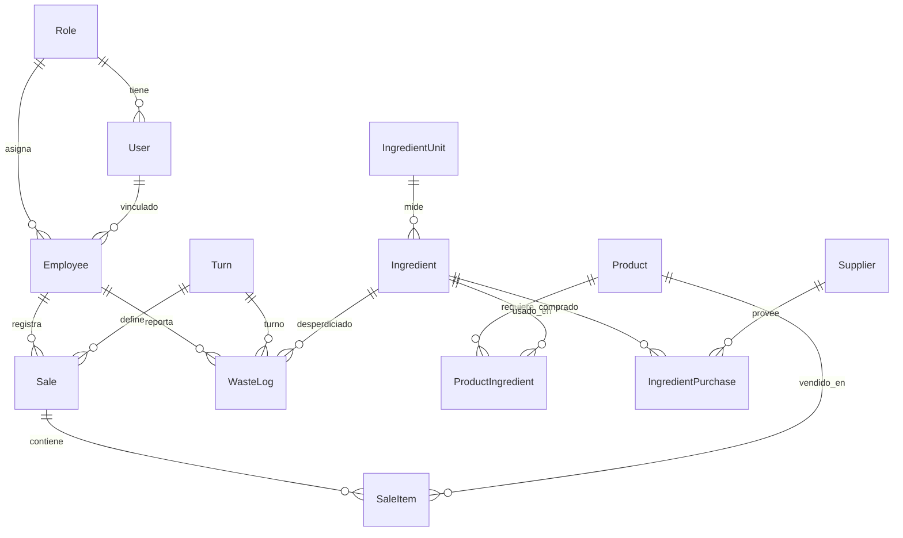

# ☕ Coffee KPI Dashboard

Dashboard de gestión integral para cafetería. Recolecta datos de ventas, insumos, mermas y empleados, los procesa y presenta KPIs clave en tiempo real para la toma de decisiones.

---

## Arquitectura

**Monolítica con vertical slicing**: cada funcionalidad (módulo) contiene su propia API, lógica de negocio, acceso a datos y esquemas, siguiendo el flujo:

```
api.py → service.py → repository.py → SQLite DB
```

### Backend — FastAPI + Python 3.14

| Capa | Responsabilidad |
|------|----------------|
| `api.py` | Define endpoints, valida parámetros, retorna schemas |
| `service.py` | Lógica de negocio, cálculos de KPIs, reglas |
| `repository.py` | Sólo acceso a datos (SQL directo), sin lógica |
| `schemas.py` | Modelos Pydantic de request/response |
| `shared/` | Componentes transversales (DB, seguridad) |

### Frontend — React 19 + Vite

SPA moderna con estado global, routing protegido y consumo de API REST.

---

## Stack Tecnológico

### Backend

| Herramienta | Propósito |
|-------------|-----------|
| **FastAPI** 0.136 | Framework REST |
| **SQLite 3** | Base de datos embebida |
| **Uvicorn 0.46** | Servidor ASGI |
| **python-jose** | JWT (access + refresh tokens) |
| **passlib + bcrypt** | Hashing de contraseñas (SHA-256 + bcrypt) |
| **Pydantic** | Validación de datos |
| **python-dotenv** | Configuración por entorno |

### Frontend

| Herramienta | Propósito |
|-------------|-----------|
| **React 19** | UI declarativa |
| **Vite 8** | Build tool y dev server |
| **react-router-dom 7** | Routing SPA |
| **Zustand 5** | Estado global |
| **TailwindCSS 4** | Estilos utilitarios |
| **Recharts 3** | Gráficas y visualizaciones |
| **Axios** | Cliente HTTP con interceptors |
| **react-toastify** | Notificaciones |
| **react-icons** | Iconos (Feather) |
| **date-fns** | Manipulación de fechas |
| **clsx** | Clases condicionales |

---

## Estructura del Proyecto

```
coffee-kpi-dashboard/
│
├── backend/
│   ├── main.py                      # Punto de entrada FastAPI
│   ├── pyproject.toml               # Dependencias Python (Poetry)
│   ├── .env                         # Variables de entorno
│   │
│   ├── database/
│   │   ├── schema.sql               # Esquema DDL (3FN)
│   │   ├── views.sql                # 9 vistas analíticas
│   │   └── coffee_main_sgc.db       # Base de datos SQLite
│   │
│   ├── shared/
│   │   ├── database.py              # Conexión e inicialización DB
│   │   └── security/
│   │       ├── jwt_handler.py       # Creación/verificación de JWT
│   │       ├── hash.py              # SHA-256 + bcrypt
│   │       └── dependencies.py      # Dependencias FastAPI (guardián)
│   │
│   └── modulos/
│       ├── auth/
│       │   ├── schemas.py           # Modelos de auth
│       │   ├── repository.py        # CRUD usuarios y empleados
│       │   ├── register/
│       │   │   ├── api.py           # POST /auth/register
│       │   │   └── service.py
│       │   ├── login/
│       │   │   ├── api.py           # POST /auth/login
│       │   │   └── service.py
│       │   ├── refresh/
│       │   │   ├── api.py           # POST /auth/refresh
│       │   │   └── service.py
│       │   └── users/
│       │       ├── api.py           # CRUD usuarios (admin)
│       │       └── service.py
│       │
│       ├── employees/
│       │   ├── api.py               # CRUD empleados (admin)
│       │   ├── service.py
│       │   └── repository.py
│       │
│       ├── ventas/
│       │   ├── create_sale/
│       │   │   ├── api.py           # POST /ventas/crea_venta
│       │   │   ├── service.py
│       │   │   ├── repository.py
│       │   │   └── schemas.py
│       │   ├── get_sale/
│       │   │   ├── api.py           # GET /ventas/sale
│       │   │   ├── service.py
│       │   │   ├── repository.py
│       │   │   └── schemas.py
│       │   └── get_daily_sales/     # (stub — pendiente)
│       │
│       ├── insumos/
│       │   ├── api.py               # CRUD ingredientes, proveedores, compras
│       │   ├── service.py
│       │   ├── repository.py
│       │   └── schemas.py
│       │
│       ├── merma/
│       │   ├── api.py               # CRUD desperdicios + analytics
│       │   ├── service.py
│       │   ├── repository.py
│       │   └── schemas.py
│       │
│       ├── KPIs/
│       │   ├── api.py               # Endpoints de KPIs y dashboard
│       │   ├── service.py
│       │   ├── repository.py
│       │   └── schemas.py
│       │
│       └── roles/
│           ├── api.py               # Permisos por rol
│           ├── service.py
│           ├── repository.py
│           └── schemas.py
│
├── frontend/
│   ├── index.html
│   ├── vite.config.js
│   ├── tailwind.config.js
│   ├── package.json
│   ├── .env.local                   # VITE_API_URL=http://localhost:8000
│   │
│   └── src/
│       ├── main.jsx                 # Entry point React
│       ├── App.jsx                  # Router + layout global
│       ├── index.css                # Tailwind directives
│       │
│       ├── pages/
│       │   ├── auth/
│       │   │   ├── LoginPage.jsx
│       │   │   └── RegisterPage.jsx
│       │   ├── dashboard/
│       │   │   └── DashboardPage.jsx
│       │   └── NotFoundPage.jsx
│       │
│       ├── components/
│       │   └── common/
│       │       └── PrivateRoute.jsx
│       │
│       ├── hooks/
│       │   ├── useAuth.js           # Hook de autenticación
│       │   └── useForm.js           # (pendiente)
│       │
│       ├── store/
│       │   └── authStore.js         # Estado global de auth (Zustand)
│       │
│       └── services/
│           ├── api.js               # Axios instance + interceptors
│           └── authService.js       # Llamadas a /auth/*
│
├── doc/
│   ├── doc-modelo-datos.md          # Documentación del modelo de datos
│   └── doc-librerias-npm.md         # Setup de librerías frontend
│
└── README.md
```

---

## Modelo de Datos

Base de datos **SQLite** normalizada en **3FN** con desnormalización selectiva en tablas de hechos.

### Dimensiones (cambian poco)

`Role`, `User`, `Employee`, `Turn`, `Product`, `Ingredient`, `IngredientUnit`, `Supplier`, `ProductIngredient`

### Transacciones (operación diaria)

`Sale`, `SaleItem`, `IngredientPurchase`, `WasteLog`

### Diagrama ERD


```mermaid
erDiagram
    Role ||--o{ User : tiene
    Role ||--o{ Employee : asigna
    User ||--o{ Employee : vinculado
    Employee ||--o{ Sale : registra
    Employee ||--o{ WasteLog : reporta
    Turn ||--o{ Sale : define
    Turn ||--o{ WasteLog : turno
    Sale ||--o{ SaleItem : contiene
    Product ||--o{ SaleItem : vendido_en
    Product ||--o{ ProductIngredient : requiere
    Ingredient ||--o{ ProductIngredient : usado_en
    Ingredient ||--o{ IngredientPurchase : comprado
    Ingredient ||--o{ WasteLog : desperdiciado
    Supplier ||--o{ IngredientPurchase : provee
    IngredientUnit ||--o{ Ingredient : mide
```

### Vistas Analíticas (SQL)

| Vista | Propósito |
|-------|-----------|
| `v_avg_ingredient_cost` | Costo promedio ponderado por insumo |
| `v_product_cost` | Costo teórico unitario por producto (receta) |
| `v_product_revenue` | Ingresos y unidades vendidas por producto |
| `v_sales_by_turn` | Ventas agrupadas por turno y fecha |
| `v_ingredient_consumption` | Consumo teórico de insumos (desde recetas) |
| `v_consumption_value` | Valor del consumo teórico |
| `v_waste_value` | Valor de la merma |
| `v_product_margin` | Margen bruto por producto |
| `v_waste_ratio` | Ratio global de desperdicio |

---

## API — Endpoints

### Autenticación

| Método | Ruta | Auth | Descripción |
|--------|------|------|-------------|
| POST | `/auth/register` | — | Registro de usuario |
| POST | `/auth/login` | — | Inicio de sesión |
| POST | `/auth/refresh` | — | Renovar access token |
| GET | `/auth/me` | Bearer | Perfil del usuario actual |
| GET | `/auth/users` | Admin | Listar todos los usuarios |
| GET | `/auth/users/{id}` | Admin | Obtener usuario por ID |
| PUT | `/auth/users/{id}` | Admin | Actualizar usuario |
| DELETE | `/auth/users/{id}` | Admin | Eliminar usuario |
| PATCH | `/auth/users/{id}/status` | Admin | Activar/desactivar usuario |

### Empleados

| Método | Ruta | Auth | Descripción |
|--------|------|------|-------------|
| POST | `/employees` | Admin | Crear empleado |
| GET | `/employees` | Admin | Listar todos |
| GET | `/employees/active` | — | Listar activos |
| GET | `/employees/{id}` | Admin | Obtener por ID |
| PUT | `/employees/{id}` | Admin | Actualizar |
| DELETE | `/employees/{id}` | Admin | Eliminar |
| PATCH | `/employees/{id}/status` | Admin | Activar/desactivar |

### Ventas

| Método | Ruta | Auth | Descripción |
|--------|------|------|-------------|
| POST | `/ventas/crea_venta` | Bearer | Crear venta con items |
| GET | `/ventas/sale` | Bearer | Listar ventas |
| GET | `/ventas/sale/{id}` | Bearer | Obtener venta por ID |

### Insumos

| Método | Ruta | Auth | Descripción |
|--------|------|------|-------------|
| POST | `/ingredients/suppliers` | Admin | Crear proveedor |
| GET | `/ingredients/suppliers` | — | Listar proveedores |
| GET | `/ingredients/suppliers/{id}` | — | Obtener proveedor |
| GET | `/ingredients` | — | Listar ingredientes |
| GET | `/ingredients/{id}` | — | Obtener ingrediente |
| GET | `/ingredients/{id}/stock` | — | Stock y costo por insumo |
| POST | `/ingredients/purchases` | — | Registrar compra |
| GET | `/ingredients/purchases` | — | Listar compras |
| GET | `/ingredients/purchases/{id}` | — | Obtener compra |
| GET | `/ingredients/purchases/by-ingredient/{id}` | — | Compras por insumo |
| GET | `/ingredients/purchases/by-supplier/{id}` | — | Compras por proveedor |
| POST | `/ingredients/purchases/by-date-range` | — | Compras por rango de fechas |
| DELETE | `/ingredients/purchases/{id}` | Admin | Eliminar compra |

### Merma (Desperdicio)

| Método | Ruta | Auth | Descripción |
|--------|------|------|-------------|
| POST | `/waste` | — | Registrar desperdicio |
| GET | `/waste` | — | Listar registros |
| GET | `/waste/{id}` | — | Obtener por ID |
| DELETE | `/waste/{id}` | Admin | Eliminar |
| GET | `/waste/by-ingredient/{id}` | — | Por insumo |
| GET | `/waste/by-employee/{id}` | — | Por empleado |
| GET | `/waste/by-turn/{id}` | — | Por turno |
| POST | `/waste/by-date-range` | — | Por rango de fechas |
| GET | `/waste/analytics/ingredient/{id}` | — | Analytics por insumo |
| POST | `/waste/analytics/date-range` | — | Analytics por fecha |
| GET | `/waste/analytics/reasons-summary` | — | Resumen por motivo |

### KPIs

| Método | Ruta | Auth | Descripción |
|--------|------|------|-------------|
| GET | `/kpis/dashboard` | — | Métricas completas del dashboard |
| GET | `/kpis/revenue/total` | — | Ingresos totales |
| POST | `/kpis/revenue/by-date-range` | — | Ingresos por fecha |
| GET | `/kpis/revenue/products` | — | Ingresos por producto |
| GET | `/kpis/revenue/top-products` | — | Top productos |
| GET | `/kpis/cogs` | — | Costo de ventas (COGS) |
| GET | `/kpis/gross-profit` | — | Ganancia bruta |
| GET | `/kpis/margins/products` | — | Margen por producto |
| GET | `/kpis/waste-ratio` | — | Ratio de desperdicio global |
| POST | `/kpis/waste-ratio/by-date-range` | — | Ratio por fecha |
| GET | `/kpis/sales/daily/{date}` | — | Resumen ventas del día |
| GET | `/kpis/sales/by-turn/{turn_id}` | — | Ventas por turno |
| GET | `/kpis/sales/by-employee/{employee_id}` | — | Ventas por empleado |

### Roles y Permisos

| Método | Ruta | Auth | Descripción |
|--------|------|------|-------------|
| POST | `/roles/permissions` | Admin | Crear permiso |
| GET | `/roles/{role_id}/permissions` | — | Permisos por rol |
| GET | `/roles` | — | Roles con permisos |
| GET | `/roles/current/permissions` | Bearer | Permisos del usuario actual |
| POST | `/roles/check` | — | Verificar permiso específico |
| DELETE | `/roles/permissions/{id}` | Admin | Eliminar permiso |

---

## KPIs Calculados

| KPI | Fórmula | Fuente |
|-----|---------|--------|
| **Ingresos por turno** | `SUM(quantity × unit_price)` | `v_sales_by_turn` |
| **Costo por taza** | `SUM(pi.quantity × costo_promedio_ingrediente)` | `v_product_cost` |
| **Margen bruto** | `(revenue − cost) / revenue` | `v_product_margin` |
| **Consumo teórico** | `SUM(si.quantity × pi.quantity)` | `v_ingredient_consumption` |
| **Valor desperdicio** | `SUM(w.quantity × costo_promedio)` | `v_waste_value` |
| **Ratio de desperdicio** | `waste / (consumo + waste)` | `v_waste_ratio` |

---

## Autenticación y Seguridad

- **JWT dual**: access token (30 min) + refresh token (7 días)
- **Password hashing**: SHA-256 (pre-hash para evitar límite de 72 bytes de bcrypt) + bcrypt con 12 rounds
- **Guard middleware**: `get_current_user()` valida token y existe en BD; `get_current_admin()` verifica role_id = 0
- **Interceptor frontend**: Axios interceptor agrega `Authorization: Bearer` y redirige a `/login` en 401

---

## Instalación y Ejecución

### Requisitos

- Python 3.14+
- Node.js 22+
- Poetry (opcional, para backend)

### Backend

```bash
cd backend

# Crear y activar entorno virtual
python -m venv .venv && source .venv/bin/activate

# Instalar dependencias
pip install -r requirements.txt
# o con Poetry:
poetry install

# Configurar variables de entorno (.env)
cat > .env << EOF
BD_PATH=database/coffee_main_sgc.db
SCHEMA_PATH=database/schema.sql
VIEWS_PATH=database/views.sql
JWT_SECRET_KEY=your-secret-key
JWT_ALGORITHM=HS256
JWT_EXPIRATION_MINUTES=30
JWT_REFRESH_EXPIRATION_DAYS=7
LOG_LEVEL=INFO
EOF

# Inicializar BD (primera vez)
python shared/database.py

# Ejecutar servidor
uvicorn main:app --reload --port 8000
```

### Frontend

```bash
cd frontend
npm install
npm run dev
# Abrir en http://localhost:5173
```

---

## Variables de Entorno

### Backend (`.env`)

| Variable | Default | Descripción |
|----------|---------|-------------|
| `BD_PATH` | — | Ruta a la base de datos SQLite |
| `SCHEMA_PATH` | — | Ruta al archivo schema.sql |
| `VIEWS_PATH` | — | Ruta al archivo views.sql |
| `JWT_SECRET_KEY` | — | Clave secreta para firmar JWT |
| `JWT_ALGORITHM` | `HS256` | Algoritmo JWT |
| `JWT_EXPIRATION_MINUTES` | `30` | Tiempo de vida access token |
| `JWT_REFRESH_EXPIRATION_DAYS` | `7` | Tiempo de vida refresh token |
| `LOG_LEVEL` | `INFO` | Nivel de logging |

### Frontend (`.env.local`)

| Variable | Default | Descripción |
|----------|---------|-------------|
| `VITE_API_URL` | `http://localhost:8000` | URL base de la API |
| `VITE_APP_NAME` | `Coffee KPI Dashboard` | Nombre de la aplicación |

---

## Fases de Desarrollo

### ✅ Fase 1 — MVP (Completada)
- Backend FastAPI funcional con todos los módulos
- Base de datos SQLite con schema y vistas
- Autenticación JWT completa
- Frontend con login/registro y routing protegido
- APIs CRUD para todas las entidades
- Cálculo de KPIs vía SQL views

### 🔄 Fase 2 — Estabilización (En progreso)
- Dashboard con gráficas (Recharts)
- Filtros dinámicos
- UI/UX responsiva
- Logging estructurado
- Tests

### ⏳ Fase 3 — Producto Profesional (Futuro)
- Migración a PostgreSQL
- Dockerización
- Despliegue en nube
- Exportación PDF/Excel
- Roles y permisos granulares
- Historial de precios

---

## Autor

**Ariel Nuñez Salinas** — [ariel.nunez.sa@protonmail.com](mailto:ariel.nunez.sa@protonmail.com)
