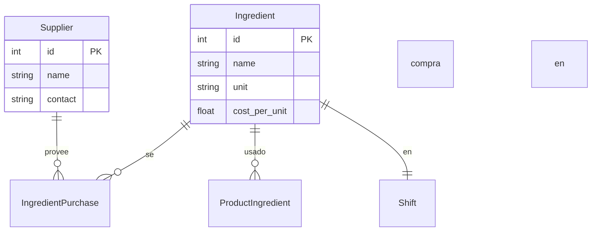

# Modelo de Datos

## Algunas generalidades: 

* *Shift* (turno) será la entidad central. Será la únidad de análisis primaria para la cafetería. A partir de este se podrá realizar análisis diarios, semanales y mensuales. El *shift_id* en Sale se asigna automáticamente comparando sold_at contra los rangos 

* *PriceHistory* para productos e IngredientCostHistory para los precios insumos, ya que estos cambian con respecto al tiempo.

* *WasteLog* para registrar desperdicio por insumo/turno. Esto corresponde a fallas, pedidos que no se realizaron, o devolvieron. 

* **SaleItem.unit_price** se mantiene como snapshot del precio en el momento de venta

* El costo teórico vs real se resuelve con dos **VIEWs**: una desde *ProductIngredient + IngredientCostHistory*, otra desde *IngredientPurchase + WasteLog*. 

* *Target* ahora tiene shift_type opcional (mañana/tarde/noche) además de período semanal/mensual


start_time/end_time, sin que el barista tenga que seleccionarlo.
WasteLog se liga directamente a Ingredient (no a Product) porque el desperdicio ocurre a nivel de insumo: se bota leche, no un latte. Esto permite calcular waste_ratio con precisión real.
unit_price se guarda en SaleItem como snapshot del precio vigente al momento de la venta. Así, si mañana sube el precio del latte, los reportes históricos no se alteran.

## Variables del modelo explicadas
A continuación se muestran las variables del modelo para el cafe, sus variables y cómo deben obtenerse. 

### Dimensionales
Son ingresadas una vez por definición o acuerdo y cambian poco. 

| Variable | Significado | Cómo se obtiene |
|----------|-------------|-----------------|
|```product.name```       | Nombre del producto vendido (ej. "Latte 12oz") | Definido / Manual |
|```product.category```   | Categoría (café, té, comida, otro) | Definido / Manual |
|```product.base_price``` | Precio de venta vigente | Definido / Manual |
|```ingredient.name```    | Nombre del insumo (ej. "Leche entera") | Definido / Manual |
|```ingredient.unit```    | Unidad de medida (ml, g, oz, unidad) | Definido / Manual |
|```ingredient.cost_per_unit```     | Costo actual del insumo por unidad | Se actualiza al registrar cada compra |
|```product_ingredient.quantity```  | Cantidad de insumo que usa 1 unidad del producto | Definido / Manual (la "receta") | 
|```employee.name```  | Nombre del barista o gerente | Definido / Manual |
|```employee.role```  | Rol: barista o manager | Definido / Manual |                         |
|```shift.label```    | Nombre del turno (Mañana / Tarde / Noche) | Definido / Manual |      |
|```shift.start_time / end_time``` | Horario de inicio y fin del turno | Definido / Manual | |
------------------

### Transaccionales
Son aquellas que se ingresan en la operación diaria. 

| Variable | Significado | Cómo se obtiene | 
|----------|-------------|-----------------|
|```sale.sold_at```  | Fecha y hora exacta de la venta | Automático (timestamp al registrar) |
|```sale.shift_id``` | Turno en que ocurrió la venta   | Calculado automáticamente según hora
|```sale.employee_id```| Barista que registró la ventaLogin del barista en la app
|```sale_item.product_id```  | Producto vendid oSelección en la app
|```sale_item.quantity```    | Cuántas unidades se vendieron | Ingreso por barista
| ```sale_item.unit_price``` | Precio al momento de la venta | Copiado automáticamente desde ```product.base_price```
| ```ingredient_purchase.ingredient_id``` | Insumo comprado   | Selección al registrar |
| ```compraingredient_purchase.quantity```| Cantidad comprada | Ingreso por gerente o barista |
| ```ingredient_purchase.unit_cost```     | Costo pagado en esa compra | Ingreso manual (desde factura/boleta)
| ```waste_log.ingredient_id```           |Insumo desperdiciado | Registrado por barista al final del turno
| ```waste_log.quantity```  | Cantidad desperdiciada | Ingreso por barista | 
|```waste_log.reason```     | Motivo (caducidad, error de preparación, derrame) | Selección de lista por barista |
------------------


### KPIs derivados 
Estas se calculan, no se guardan — viven en VIEWs.

| KPI | Significado | Fórmula |
|-----|-------------|---------|
| ```revenue_per_shift``` | Ingresos totales por turno | ```SUM(sale_item.quantity × unit_price)``` agrupado por ```shift``` |
|```cost_per_cup``` | Costo de ingredientes por unidad vendida | ```SUM(ingredient.cost_per_unit × product_ingredient.quantity)``` por producto
| ```gross_margin```| Margen bruto por producto o turno | ```(unit_price − cost_per_cup) / unit_price × 100``` |```ingredient_consumption``` | Insumos consumidos por período | ```SUM(sale_item.quantity × product_ingredient.quantity)``` por ingrediente
|```waste_value```   | Valor económico del desperdicio  |  ```SUM(waste_log.quantity × ingredient.cost_per_unit)```
|```waste_ratio``` | % de insumo desperdiciado vs consumido | ```waste_value / (consumption_value + waste_value) × 100```
------------------

## Esquema del Modelo (ERD)




