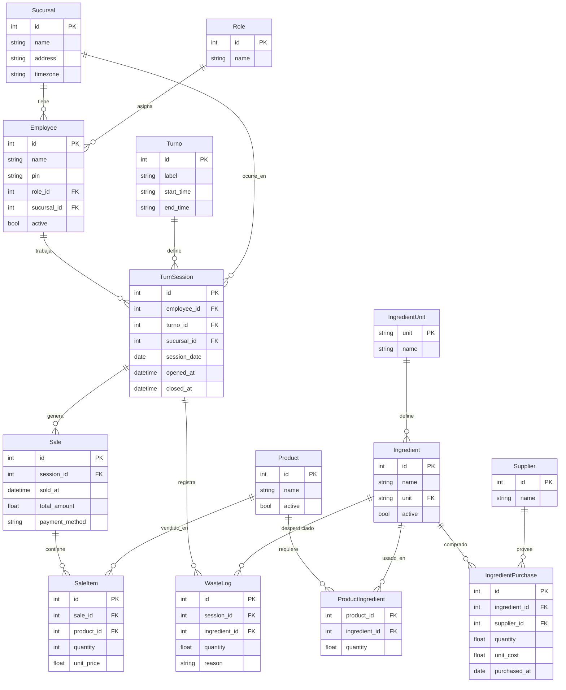

# Modelo de Datos

Las tablas se organizan en 2 grupos. **Las dimensiones**:  ```Supplier```, ```Ingredient```, ```Turn```, ```Employee```, ```Product```, corresponden a tablas que rara vez cambian. En el EDR no salen pero internamente también se definen las tablas ```Sucursal```, ```Role```, y ```Category```. La primera es siempre 1 porque solo tendremos 1 sucursal, el Role corresponde a si es barista, o administrador. Y categoría se refiere a que categoría pertenece el producto vendido, por ejemplo bebestible, 

<!-- FALTAN: (Sucursal, , Role, ,, Category, , )--> 

Las tablas de hechos: ```IngredientPurchase```, ```WasteLog```, ```Sale```,```SaleItem```. 


que cambian constantemente pues registran todo lo que ocurre en el día a día. 

>**Decisiones notables**:
ProductPrice e IngredientCost son tablas separadas con effective_from, lo que permite que cambies precios y costos sin romper el historial de ventas anteriores.
SaleItem.unit_price guarda el precio en el momento exacto de venta (desnormalización intencional), por la misma razón.

TurnSession es el nodo central: conecta al barista, el turno y la fecha, y desde ahí cuelgan las ventas, el desperdicio y el cierre de caja.
Próximo paso: ¿Quieres que genere también el seed.sql con datos de prueba, o el script Python (db_setup.py) que crea la base, carga el schema y expone funciones de consulta para el dashboard?


## Algunas generalidades: 

* *TurnSession* (Sesión del turno) será la entidad central. Será la únidad de análisis primaria para la cafetería. A partir de este se podrá realizar análisis diarios, semanales y mensuales. El *turn_id* en Sale se asigna automáticamente comparando sold_at contra los rangos *start_time/end_time*, sin que el barista tenga que seleccionarlo.

* *WasteLog* para registrar desperdicio por insumo/turno. Se liga directamente a *Ingredient* (no a *Product*) porque el desperdicio ocurre a nivel de insumo: **se bota leche, no un latte**. Esto permite calcular waste_ratio con precisión real.

* *SaleItem.unit_price* se guarda como snapshot del precio vigente en el momento de venta. Así, si mañana sube el precio del latte, los reportes históricos no se ven alterados.

* El costo teórico vs real se resuelve con dos **VIEWs**: una desde *ProductIngredient + IngredientCostHistory*, otra desde *IngredientPurchase + WasteLog*. 

## Variables del modelo explicadas
A continuación se muestran las variables del modelo para el cafe, sus variables y cómo deben obtenerse. 

### Dimensionales
Son ingresadas una vez por definición o acuerdo y cambian poco. 
| Variable                         | Significado                 | Cómo se obtiene |
| -------------------------------- | --------------------------- | --------------- |
| `product.name`                   | Nombre del producto         | Manual          |
| `product.category`               | Categoría                   | Manual          |
| `product.base_price`             | Precio base actual          | Manual          |
| `ingredient.name`                | Nombre del insumo           | Manual          |
| `ingredient.unit`                | Unidad de medida            | Manual          |
| `product_ingredient.quantity`    | Cantidad usada por producto | Manual          |
| `employee.name`                  | Nombre empleado             | Manual          |
| `role.name`                      | Rol (barista, manager)      | Manual          |
| `turn.label`                     | Nombre del turno            | Manual          |
| `turn.start_time / end_time`     | Horario turno               | Manual          |

------------------

### Transaccionales
Son aquellas que se ingresan en la operación diaria. 
| Variable                            | Significado           | Cómo se obtiene     |
| ----------------------------------- | --------------------- | ------------------- |
| `sale.sold_at`                      | Timestamp venta       | Automático          |
| `sale.turn_id`                      | Turno                 | Calculado           |
| `sale.employee_id`                  | Quién vendió          | Login               |
| `sale_item.product_id`              | Producto              | App                 |
| `sale_item.quantity`                | Cantidad              | Manual              |
| `sale_item.unit_price`              | Precio en ese momento | Copia de base_price |
| `ingredient_purchase.ingredient_id` | Insumo                | Selección           |
| `ingredient_purchase.quantity`      | Cantidad comprada     | Manual              |
| `ingredient_purchase.unit_cost`     | Precio real compra    | Manual              |
| `ingredient_purchase.purchased_at`  | Timestamp compra      | Automático          |
| `waste_log.ingredient_id`           | Insumo desperdiciado  | Manual              |
| `waste_log.quantity`                | Cantidad              | Manual              |
| `waste_log.reason`                  | Motivo                | Selección           |
| `waste_log.turn_id`                 | Turno                 | Automático          |
| `waste_log.employee_id`             | Quién registró        | Login               |

------------------

### KPIs derivados 
Estas se calculan, no se guardan — viven en VIEWs.

| KPI                      | Significado       | Fórmula                                         |
| ------------------------ | ----------------- | ----------------------------------------------- |
| `revenue_per_turn`       | Ventas por turno  | `SUM(quantity * unit_price)`                    |
| `cost_per_cup`           | Costo receta      | `SUM(pi.quantity * costo_promedio_ingrediente)` |
| `gross_margin`           | Margen            | `(revenue - cost) / revenue`                    |
| `ingredient_consumption` | Consumo teórico   | `SUM(si.quantity * pi.quantity)`                |
| `waste_value`            | Valor desperdicio | `SUM(w.quantity * costo_promedio)`              |
| `waste_ratio`            | % desperdicio     | `waste / (consumo + waste)`                     |

------------------

## Esquema del Modelo (ERD)
Principales relaciones



